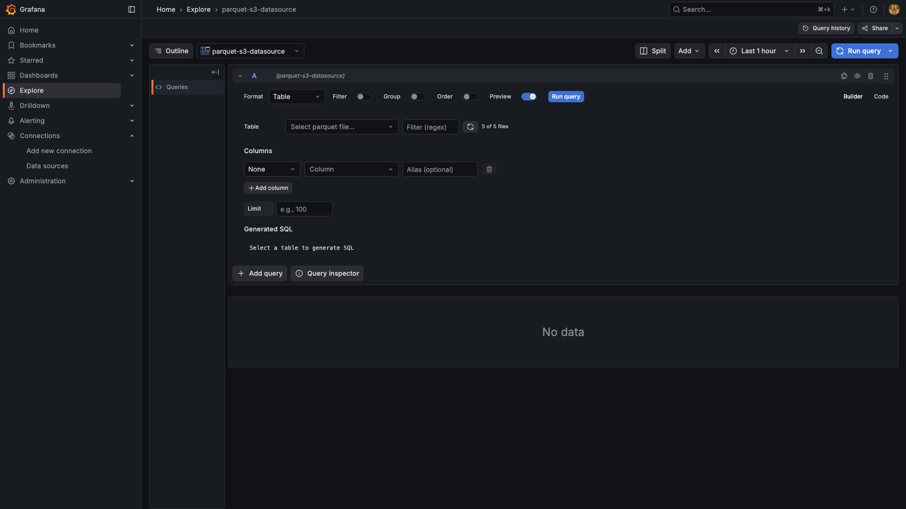
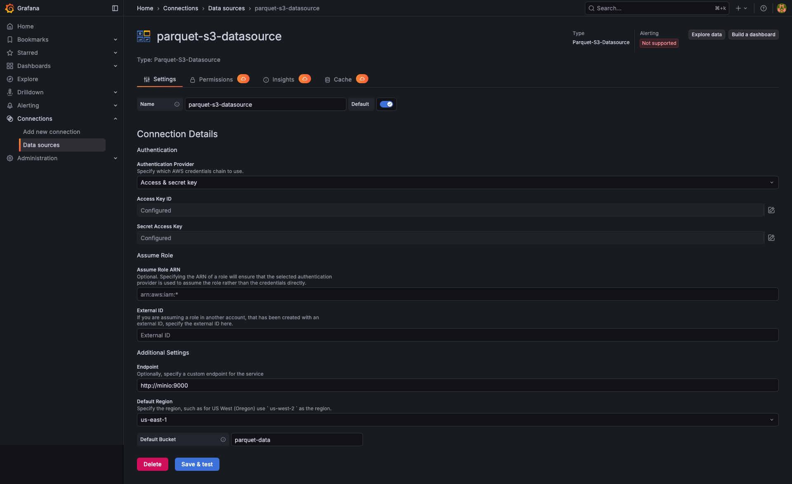
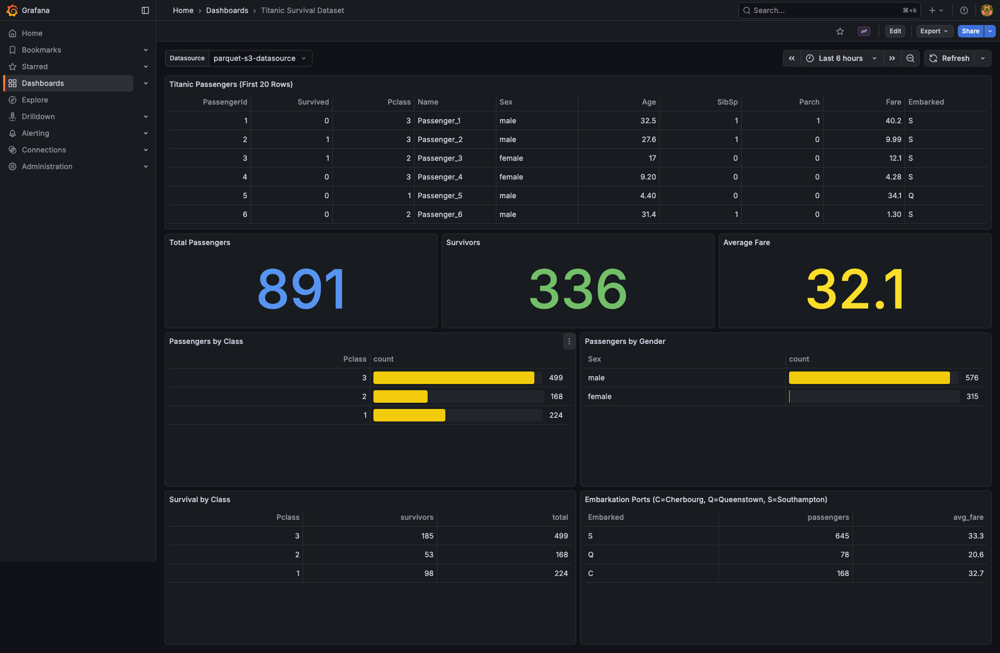
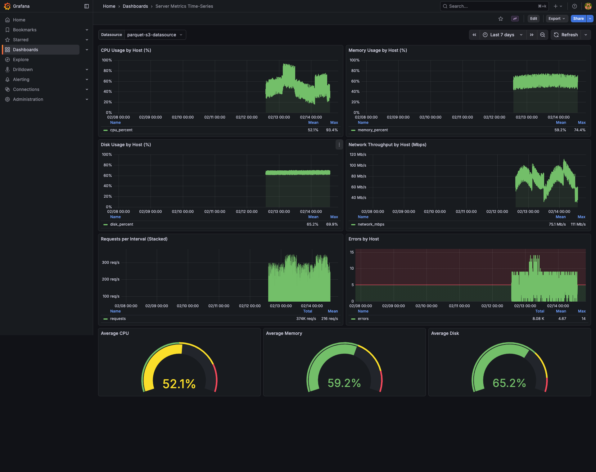
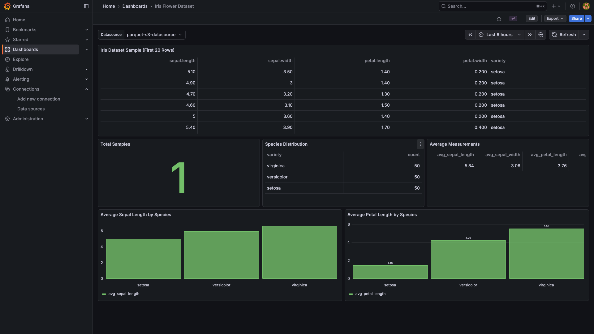

# Parquet-S3-Datasource for Grafana

**by tobiasworkstech**

Query and visualize Apache Parquet files stored in Amazon S3 or S3-compatible storage directly in Grafana with full SQL support.

## Overview

The Parquet-S3-Datasource plugin enables you to connect Grafana to your data lake stored in Parquet format on Amazon S3, MinIO, Wasabi, DigitalOcean Spaces, or any S3-compatible storage. Leverage the efficiency of columnar Parquet files for fast analytics and visualization without needing to load data into a traditional database.

## Screenshots

### Query Editor


### Datasource Configuration


### Iris Flower Dataset Dashboard


### Titanic Survival Dataset Dashboard


### Server Metrics Time-Series Dashboard


### Template Variables


## Features

### Core Features
- **Direct Parquet File Access**: Query Parquet files directly from S3 without intermediate databases
- **S3-Compatible Storage Support**: Works with Amazon S3, MinIO, Wasabi, DigitalOcean Spaces, and more
- **Apache Arrow Integration**: Efficient data processing using Apache Arrow for fast query execution
- **Configurable Endpoints**: Support for custom S3 endpoints for private cloud deployments
- **Path-Style Routing**: Automatic configuration for S3-compatible storage that requires path-style URLs

### SQL Query Support (v1.1.0+)
- **SQL Subset**: A built-in, in-memory SQL engine supporting SELECT, WHERE, GROUP BY, ORDER BY, and LIMIT
- **Aggregation Functions**: COUNT, SUM, AVG, MIN, MAX
- **Filtering**: `=`, `!=`, `>`, `<`, `>=`, `<=`, `LIKE`, `IN`, `IS NULL`, `IS NOT NULL` with AND/OR composition
- **Column Aliasing**: Rename columns in query results

> Note: The SQL engine is a custom, lightweight in-memory executor built into the plugin — it is **not** DuckDB. Only the subset of SQL listed above is supported. DuckDB-specific functions, window functions, CTEs, and JOINs are not available.

### Visual Query Builder
- **PostgreSQL-Style Interface**: Familiar query building experience
- **Column Selection**: Pick columns with optional aggregations
- **Filter Toggle**: Build WHERE conditions visually
- **Group Toggle**: Add GROUP BY clauses easily
- **Order Toggle**: Sort results with ASC/DESC
- **SQL Preview**: See the generated SQL in real-time

### Template Variables
- **List Files**: Populate variables with parquet files from your bucket
- **List Prefixes**: Get folder/prefix names for hierarchical navigation
- **SQL-Based Variables**: Use SQL queries to generate variable values
- **Regex Filtering**: Filter file lists with regex patterns

### Grafana Explore
- **File Browser**: Select parquet files with search and filtering
- **Builder Mode**: Visual query construction
- **Code Mode**: Raw SQL editing with syntax highlighting

## Requirements

- Grafana >= 11.0.0
- S3 or S3-compatible storage with read access
- Parquet files in your S3 bucket

## Getting Started

### Installation

Install the plugin using the Grafana CLI:

```bash
grafana-cli plugins install tobiasworkstech-parquets3-datasource
```

Or via Docker:

```bash
docker run -d -p 3000:3000 \
  -e "GF_INSTALL_PLUGINS=tobiasworkstech-parquets3-datasource" \
  grafana/grafana
```

### Configuration

1. Navigate to **Configuration** > **Data Sources** in your Grafana instance
2. Click **Add data source**
3. Search for and select **Parquet-S3-Datasource**
4. Configure the following settings:
   - **Region**: Your S3 region (e.g., `us-east-1`)
   - **Bucket**: The name of your S3 bucket containing Parquet files
   - **Endpoint** (optional): Custom S3 endpoint URL (e.g., `http://minio:9000` for MinIO)
   - **Access Key**: Your S3 access key ID
   - **Secret Key**: Your S3 secret access key
5. Click **Save & test** to verify the connection

### Basic Usage

1. Create a new dashboard or open an existing one
2. Add a new panel
3. Select your Parquet-S3-Datasource as the data source
4. Select a parquet file from the **Table** dropdown
5. Use the visual builder or write SQL directly
6. Click **Run query** to visualize your data

### SQL Query Examples

```sql
-- Select all data
SELECT * FROM parquet

-- Filter and sort
SELECT name, value FROM parquet
WHERE value > 100
ORDER BY value DESC

-- Aggregations
SELECT category, COUNT(*) as count, AVG(price) as avg_price
FROM parquet
GROUP BY category

-- Top N results
SELECT * FROM parquet
ORDER BY timestamp DESC
LIMIT 10
```

### Template Variable Examples

**List all parquet files:**
- Query Type: `List Files`
- File Pattern: `*.parquet`

**List files in a folder:**
- Query Type: `List Files`
- Prefix: `data/2024/`
- File Pattern: `*.parquet`

**SQL-based variable (unique values):**
- Query Type: `SQL Query`
- Path: `data.parquet`
- SQL: `SELECT DISTINCT category FROM parquet`

## Configuration Examples

### Amazon S3

```
Region: us-east-1
Bucket: my-data-lake
Endpoint: (leave empty)
Access Key: AKIA...
Secret Key: ***
```

### MinIO (Local Development)

```
Region: us-east-1
Bucket: parquet-data
Endpoint: http://minio:9000
Access Key: minioadmin
Secret Key: minioadmin
```

### Wasabi

```
Region: us-east-1
Bucket: my-bucket
Endpoint: https://s3.wasabisys.com
Access Key: YOUR_WASABI_KEY
Secret Key: ***
```

## Supported Parquet Features

- All primitive data types (INT32, INT64, FLOAT, DOUBLE, BOOLEAN, BINARY, STRING)
- Nested structures (STRUCT, LIST, MAP)
- Compression codecs (SNAPPY, GZIP, LZ4, ZSTD)
- Column pruning for efficient data retrieval

## Sample Dashboards

The plugin includes sample dashboards demonstrating various use cases:

- **Iris Dataset**: Classic ML dataset with flower measurements
- **Titanic Dataset**: Survival analysis with aggregations
- **Time Series Metrics**: Server metrics visualization

## Troubleshooting

### Connection Failed

- Verify your S3 credentials are correct
- Ensure the bucket exists and is accessible
- Check network connectivity to your S3 endpoint
- For custom endpoints, verify the endpoint URL format

### No Data Returned

- Confirm the Parquet file path is correct
- Ensure the file exists in the specified bucket
- Check that your access key has read permissions

### SQL Query Errors

- Verify column names match exactly (case-sensitive)
- Use double quotes for column names with special characters: `"column.name"`
- The plugin ships with a custom in-memory SQL engine that supports a **subset** of SQL: `SELECT`, `WHERE`, `GROUP BY`, `ORDER BY`, `LIMIT`, and the aggregates `COUNT`, `SUM`, `AVG`, `MIN`, `MAX`. It is **not** DuckDB — DuckDB-specific syntax, JOINs, CTEs, window functions, and scalar functions are not supported

### Invalid Plugin Signature (Development)

For development environments, add this to your Grafana configuration:

```ini
[plugins]
allow_loading_unsigned_plugins = tobiasworkstech-parquets3-datasource
```

## Development

### Prerequisites

- Go >= 1.21
- Node.js >= 20
- Docker and Docker Compose

### Building the Plugin

```bash
# Install dependencies
cd tobiasworkstech-parquets3-datasource
npm install

# Build frontend
npm run build

# Build backend for all platforms
GOOS=linux GOARCH=amd64 go build -o dist/gpx_parquet_s3_datasource_linux_amd64 ./pkg
GOOS=linux GOARCH=arm64 go build -o dist/gpx_parquet_s3_datasource_linux_arm64 ./pkg
GOOS=darwin GOARCH=arm64 go build -o dist/gpx_parquet_s3_datasource_darwin_arm64 ./pkg
GOOS=windows GOARCH=amd64 go build -o dist/gpx_parquet_s3_datasource_windows_amd64.exe ./pkg
```

### Running Locally

```bash
docker compose up -d
```

Access Grafana at `http://localhost:3001`.

## License

Apache 2.0 License - see [LICENSE](LICENSE) for details.

## Contributing

Contributions are welcome! Please open an issue or submit a pull request on [GitHub](https://github.com/tobiasworkstech/tobiasworkstech-parquets3-datasource).

## Support

For issues, questions, or feature requests, please visit the [GitHub repository](https://github.com/tobiasworkstech/tobiasworkstech-parquets3-datasource/issues).
